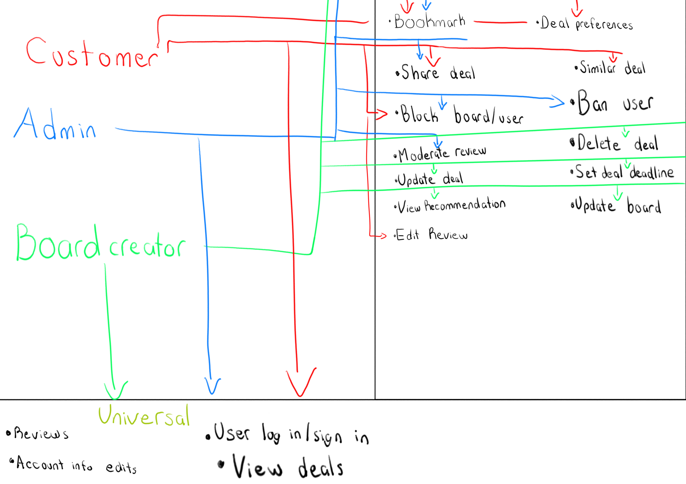
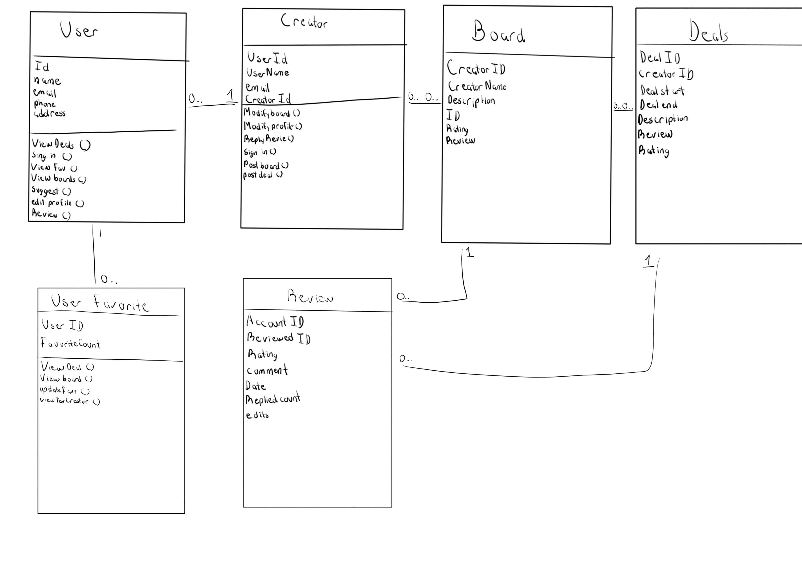
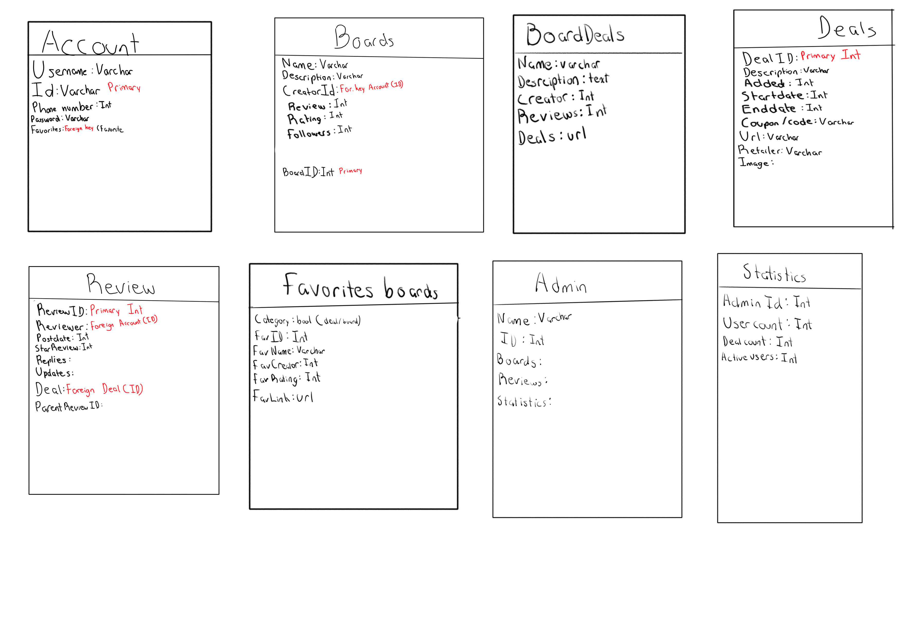

# Salify - Software Design 

Version 1  
Prepared by Franklin Lagos\Papa Dieng
Salify\
Oct 21, 2025

Table of Contents
=================
* [Revision History](#revision-history)
* 1 [Product Overview](#1-product-overview)
* 2 [Use Cases](#2-use-cases)
  * 2.1 [Use Case Model](#21-use-case-model)
  * 2.2 [Use Case Descriptions](#22-use-case-descriptions)
    * 2.2.1 [Actor: creator](#221-actor-creator)
    * 2.2.2 [Actor: customer](#222-actor-customer)
    * 2.2.3 [Actor: Admin](#223-actor-admin) 
* 3 [UML Class Diagram](#3-uml-class-diagram)
* 4 [Database Schema](#4-database-schema)

## Revision History
| Name | Date    | Reason For Changes  | Version   |
| ---- | ------- | ------------------- | --------- |
|  Franklin  |1/20     | Initial Design      |    1      |
|      |         |                     |           |
|      |         |                     |           |

## 1. Product Overview

Salify is a website for users to have an easier time finding the best deal for the item they are looking for. Users can look through the deals and boards created by other users to find the item or category of items that they are interested in. Board creators can deals that they either found or related to the category of the board.

## 2. Use Cases
### 2.1 Use Case Model

### 2.2 Use Case Descriptions

#### 2.2.1 Actor: creator

#### 2.2.1.1 Sign up

Users can create a creator account to be able to create boards or deals.

#### 2.2.1.2 Sign in

Users can sign in to their creator profile to update their boards.

#### 2.2.1.3 View Deals

Users can view deals or create deals and add deals to their boards.

#### 2.2.1.4 View Reviews

Users can view Reviews about their board and are able to reply back or report for moderation.

#### 2.2.1.5 Edit account

Creators can edit their account to update information or add more description of the kind of boards they created or update.

#### 2.2.1.6 Update Board

Creators can update the boards they created or moderate to add the latest deals, delete ended deals, update information, or update deal availability time. 

#### 2.2.1.7 View Recommendations

Creators can see recommendations provided by users to consider if those deals should be added to their boards or not.

#### 2.2.2 Actor: Customeruser-case customer 2.2.2.1
Sign in
user
User can sign in to veiw and set deal preferences
see and share deals
block board/user
edit reviews
Bookmark
user can bookmark deals or boards into their favorite list for the future 
update board
yyyyy

#### 2.2.3 Actor: Admin
Moderate reviews 
update deals
Ban users
Reviews
account info edits
set deal deadline

## 3. UML Class Diagram

## 4. Database Schema

